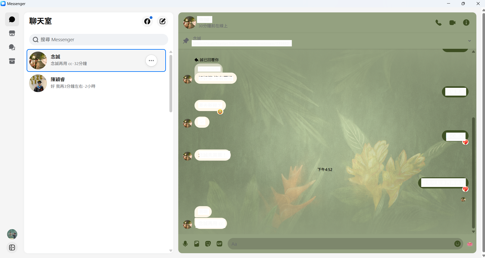

# Messenger Desktop

A lightweight desktop app for Facebook Messenger Web, built with Tauri.

Messenger Desktop gives you a focused Messenger window with a tray menu,
close-to-tray behavior, quick show/hide, startup options, and a native desktop
feel without replacing or reimplementing Messenger.

It opens the official Messenger website directly:

```text
https://www.messenger.com
```

## Demo



## Why Use It?

- Keep Messenger separate from your browser tabs.
- Hide Messenger to the system tray instead of closing it.
- Show or hide the app quickly with `Ctrl + Shift + M`.
- Reload Messenger from the tray menu.
- Choose whether the app follows system theme, light mode, or dark mode.
- Start Messenger Desktop automatically when you sign in.

## Download And Install

Download the latest installer from the GitHub Releases page.

Windows users should download one of:

```text
Messenger Desktop_*_x64-setup.exe
Messenger Desktop_*_x64_en-US.msi
```

macOS users should download the `.dmg` build that matches their Mac.

The source code `.zip` and `.tar.gz` files are added by GitHub automatically.
They are for developers, not normal installation.

## Do Users Need To Install Anything Else?

No developer tools are required. Users do not need Node.js, Rust, Cargo, npm,
or any build environment.

Windows:

- Windows 11 usually already includes Microsoft Edge WebView2 Runtime.
- Most modern Windows 10 systems also already have WebView2.
- If WebView2 is missing, Windows may ask you to install it.

macOS:

- Uses the system WebKit engine.
- No extra browser runtime is required.

## Security And Login Safety

Messenger Desktop does not handle your Facebook password.

When you log in, you are logging in on the official Messenger website inside a
desktop WebView:

```text
https://www.messenger.com
```

Your username, password, two-factor prompts, cookies, and Messenger session are
handled by Facebook / Meta through the official Messenger web page. They are not
sent to a server owned by this project.

This project does not include:

- A custom login server
- A proxy server
- A password collection form
- A Messenger token collector
- A custom Facebook API backend
- Code that uploads your Messenger messages to the app author

In simple terms: this app is a desktop shell around Messenger Web. It does not
sit between you and Facebook to read your password.

## How The App Works

Messenger Desktop has two main parts:

- A Tauri/Rust desktop shell for windows, tray menu, shortcuts, settings, and
  packaging.
- A system WebView that loads `https://www.messenger.com`.

On Windows, the WebView is powered by Microsoft Edge WebView2.
On macOS, it is powered by WebKit.

The app stores only local app preferences, such as:

```json
{
  "start_on_login": false,
  "close_to_tray": true,
  "start_minimized": false,
  "theme": "system",
  "shortcut": "Ctrl+Shift+M",
  "messenger_url": "https://www.messenger.com"
}
```

These settings control app behavior. They are not your Facebook credentials.

## Privacy Notes

Messenger Desktop does not add a new analytics service or a custom cloud backend.
It does not intentionally collect your Messenger content.

Messenger itself is still a Meta service. Anything Messenger Web normally sends
to Meta is still governed by Meta's own terms and privacy policy.

This is an unofficial project and is not affiliated with, endorsed by, or
sponsored by Meta or Facebook.

## Current Features

- Official Messenger Web in a native desktop window
- Persistent WebView session
- System tray menu
- Show, hide, reload, settings, and quit actions
- Close-to-tray behavior
- `Ctrl + Shift + M` quick show/hide shortcut
- Start on login option
- Start minimized option
- App appearance setting: system, light, or dark
- Messenger URL fallback setting
- Windows and macOS packaging through GitHub Actions

## Unsigned App Warning

Current builds are unsigned.

That means:

- Windows may show a SmartScreen warning.
- macOS may show a Gatekeeper warning.

These warnings mean the installer has not been code-signed by a paid developer
certificate. They do not mean the app is secretly sending your password away.

For a polished public release with fewer warnings, the project needs:

- A Windows code signing certificate
- An Apple Developer account
- macOS signing and notarization

## Verify The Project Yourself

If you want to inspect the app before trusting it:

- Check `src-tauri/tauri.conf.json` to see that the main window opens
  `https://www.messenger.com`.
- Check `src-tauri/src/` for the Rust desktop shell code.
- Check `src/settings.ts` for the local settings page.
- Search the codebase for network calls to confirm there is no custom backend
  receiving credentials.
- Prefer installers generated by this repository's GitHub Actions workflow.

## Build From Source

Most users do not need this section. It is only for people who want to modify or
build the app themselves.

Requirements:

- Node.js and npm
- Rust and Cargo through rustup
- Microsoft C++ Build Tools on Windows
- Microsoft Edge WebView2 Runtime on Windows

Commands:

```powershell
npm.cmd install
npm.cmd run icons
npm.cmd run build
npm.cmd run tauri -- dev
npm.cmd run tauri -- build
```

Build outputs are created under:

```text
src-tauri/target/release/bundle/
```
